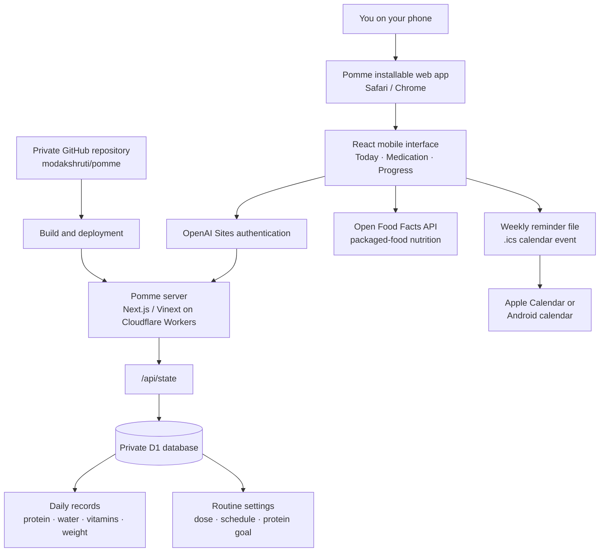
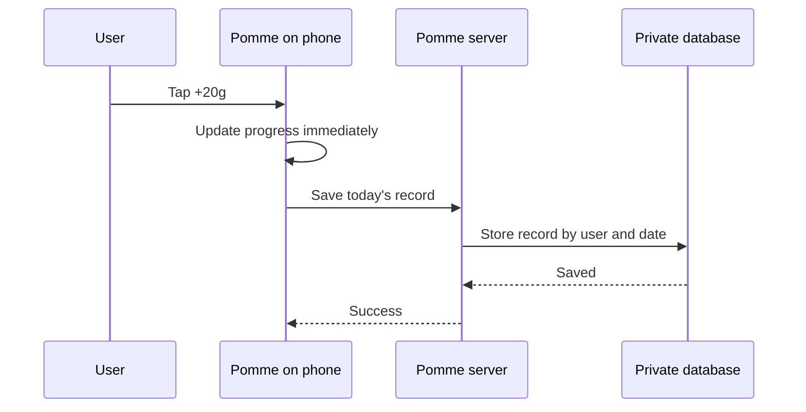

# Pomme

**Get into a healthy rhythm.**

Pomme is a private, mobile-first GLP-1 support app for tracking a weekly tirzepatide routine, protein, hydration, vitamins, and weight. It provides simple daily encouragement and can add a recurring medication reminder to the phone's calendar.

## Current features

- Weekly tirzepatide dose and schedule tracking
- Weekly dose completion check-in
- Recurring phone-calendar reminder
- Configurable vitamin and supplement checklist
- Hydration tracking
- Manual protein tracking toward a configurable goal (90 g by default)
- Packaged-food protein lookup through Open Food Facts
- Weight tracking in kilograms
- Progress-based daily encouragement
- Private, account-linked storage
- Installable phone experience

## Architecture



### Saving a daily entry

For example, when the user taps **+20g protein**:



## Technology

- **Interface:** React and Next.js/Vinext
- **Hosting:** OpenAI Sites on Cloudflare infrastructure
- **Runtime:** Cloudflare Worker-compatible server
- **Database:** Cloudflare D1 (SQLite)
- **Authentication:** OpenAI account authentication
- **Phone installation:** Progressive Web App metadata
- **Reminders:** Recurring `.ics` phone-calendar event
- **Food database:** Open Food Facts API
- **Source control:** GitHub

## Data model

Daily data is stored by authenticated user ID and calendar date:

```text
User + 2026-08-24
├── protein: 70 g
├── water: 6 glasses
├── vitamins: ["Vitamin D"]
└── weight: 79 kg
```

A separate settings record stores the protein goal, prescribed medication dose, dose day and time, configured supplements, and last recorded dose date.

## Privacy and scope

Pomme's hosted database is separate from this source repository. Personal health logs and deployment credentials are not committed to GitHub.

The current basic version does not use an AI model or the OpenAI API. Open Food Facts supplies community-maintained packaged-food data; users should confirm the label and serving size. Meal-photo nutrition estimation is outside the current scope.

Pomme supports personal tracking and is not medical advice. Medication changes and supplements should be reviewed with a qualified clinician or pharmacist.

## Run locally

```bash
npm install
npm run dev
```

Create the required local D1 database using the schema in `drizzle/0000_init.sql` and the project bindings in `.openai/hosting.json`.
