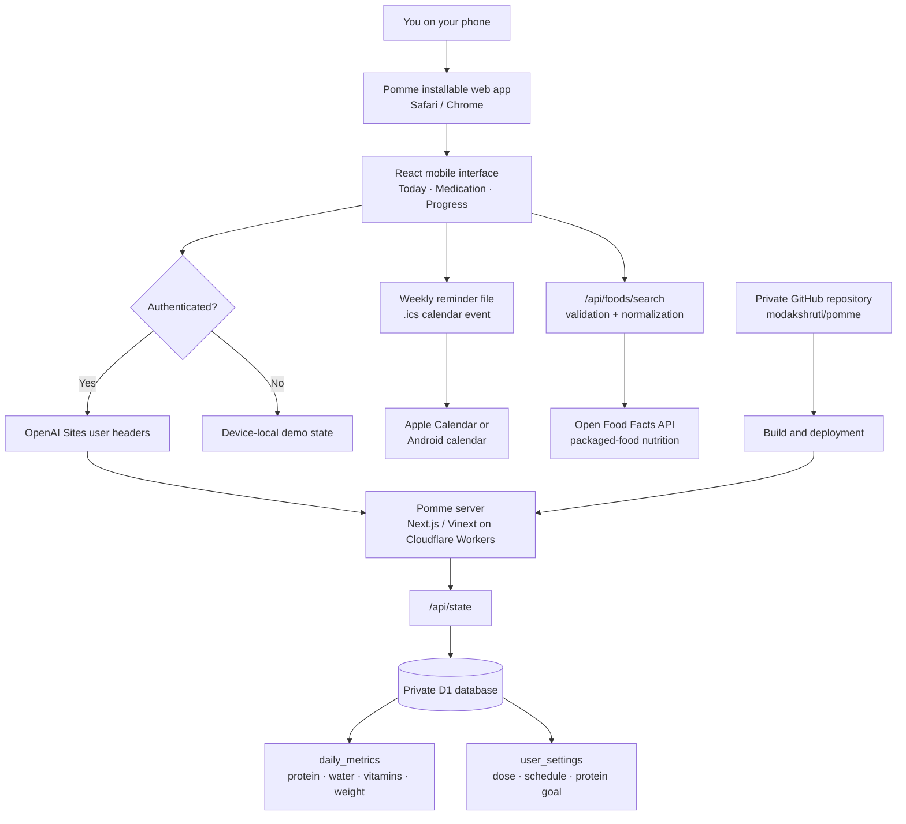
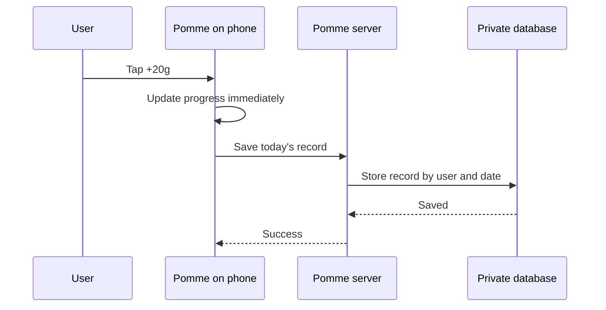

# Pomme

**Get into a healthy rhythm.**

Pomme is a mobile-first GLP-1 support app for tracking a weekly tirzepatide routine, protein, hydration, vitamins, and weight. Authenticated records are private; anonymous visitors receive a device-local portfolio demo.

**Live app:** [steady-glp1-support.modakshruti.chatgpt.site](https://steady-glp1-support.modakshruti.chatgpt.site/)

## Current features

- Weekly tirzepatide dose and schedule tracking
- Weekly dose completion check-in
- Recurring phone-calendar reminder
- Configurable vitamin and supplement checklist
- Hydration tracking
- Manual protein tracking toward a configurable goal (90 g by default)
- Packaged-food protein lookup through Open Food Facts
- Weight tracking in kilograms
- Progress-based daily encouragement
- Private, account-linked storage
- Installable phone experience
- Anonymous demo mode with device-local sample data

## Architecture



### Saving a daily entry

For example, when the user taps **+20g protein**:



## Technology

- **Interface:** React and Next.js/Vinext
- **Hosting:** OpenAI Sites on Cloudflare infrastructure
- **Runtime:** Cloudflare Worker-compatible server
- **Database:** Cloudflare D1 with normalized SQLite tables
- **Authentication:** OpenAI account authentication
- **Phone installation:** Progressive Web App metadata
- **Reminders:** Recurring `.ics` phone-calendar event
- **Food database:** Server-proxied Open Food Facts API
- **Validation:** Zod at API boundaries
- **Tests:** Vitest and GitHub Actions CI
- **Source control:** GitHub

## Data model

Daily data is stored by authenticated user ID and calendar date:

```text
User + 2026-08-24
├── protein: 70 g
├── water: 6 glasses
├── vitamins: ["Vitamin D"]
└── weight: 79 kg
```

A separate `user_settings` record stores the protein goal, prescribed medication dose, dose day and time, configured supplements, and last recorded dose date. The application can read the original JSON-based records as a migration fallback, while all new writes use the normalized tables.

## API surface

- `GET /api/state?day=YYYY-MM-DD` — read an authenticated daily record
- `GET /api/state?day=settings` — read authenticated settings
- `POST /api/state` — validate and persist daily state or settings
- `GET /api/foods/search?q=...` — validate a query, call Open Food Facts, and return a stable normalized result

Missing authentication is rejected by the state API. Anonymous demo data never reaches D1.

## Engineering decisions

- **Optimistic mobile updates:** tracking actions update immediately and persist after a short debounce.
- **Calendar rather than push infrastructure:** medication reminders use a portable recurring `.ics` event and work while Pomme is closed.
- **Server-side food adapter:** Open Food Facts response shapes are normalized behind Pomme's API rather than leaking upstream details into the UI.
- **Backward-compatible persistence:** legacy JSON rows remain readable during the move to typed relational tables.
- **Local anonymous demo:** interviewers can explore the product without gaining access to real user data.

## Security, privacy, and scope

Pomme's hosted database is separate from this source repository. Personal health logs and deployment credentials are not committed to GitHub. Server-side state routes require the hosting platform's authenticated user ID and scope every query by that ID.

### Threat model

| Risk                                    | Current control                                                   | Remaining limitation                                              |
| --------------------------------------- | ----------------------------------------------------------------- | ----------------------------------------------------------------- |
| Anonymous access to health records      | State APIs reject requests without an authenticated user header   | The deployment depends on correct OpenAI Sites header handling    |
| One user reading another user's records | Every D1 query includes the stable site-scoped user ID            | No separate role or administrative model exists                   |
| Malformed or excessive input            | Zod validates dates, goals, quantities, schedules, and list sizes | No distributed request-rate limiter is implemented                |
| Third-party food data                   | Open Food Facts is isolated behind a normalized server route      | Community data can be incomplete or incorrect                     |
| Demo data leaking into production       | Anonymous demo records stay in browser storage                    | Clearing browser storage removes demo progress                    |
| Secrets committed to source             | `.env*`, build output, and local runtime state are ignored        | Repository history should still be reviewed before public release |

The current basic version does not use an AI model or the OpenAI API. Open Food Facts supplies community-maintained packaged-food data; users should confirm the label and serving size. Meal-photo nutrition estimation is outside the current scope.

Pomme is a personal portfolio prototype, not a regulated medical device or HIPAA-compliant clinical system. It supports tracking and is not medical advice. Medication changes and supplements should be reviewed with a qualified clinician or pharmacist.

## Quality checks

```bash
npm run test
npm run lint
npm run build
```

GitHub Actions runs these checks for pushes and pull requests.

## Run locally

```bash
npm install
npm run dev
```

Create the required local D1 database using the migrations in `drizzle/` and the project bindings in `.openai/hosting.json`.
